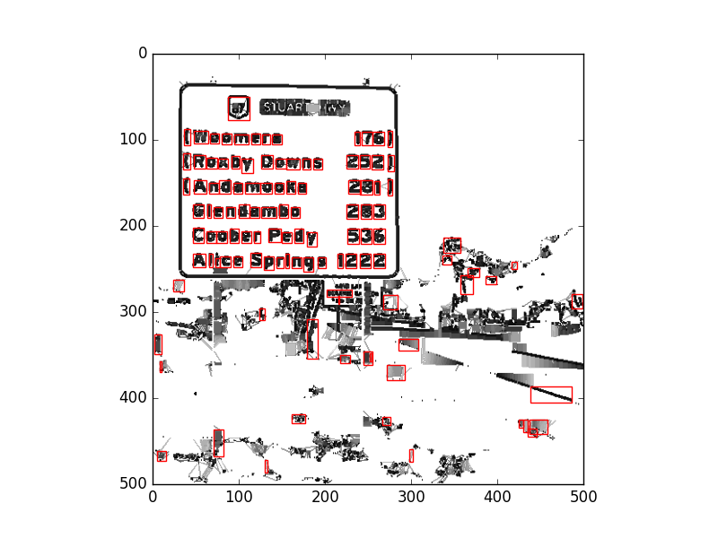

# strokewidthtransform
Implementing the Stroke Width Transform algorithm for detecting text from: http://www.math.tau.ac.il/~turkel/imagepapers/text_detection.pdf in numpy/scipy.

Before SWT (from: http://www.cs.cornell.edu/courses/cs4670/2010fa/projects/final/results/group_of_arp86_sk2357/Writeup.pdf)

After SWT (filtering not fully done yet):

